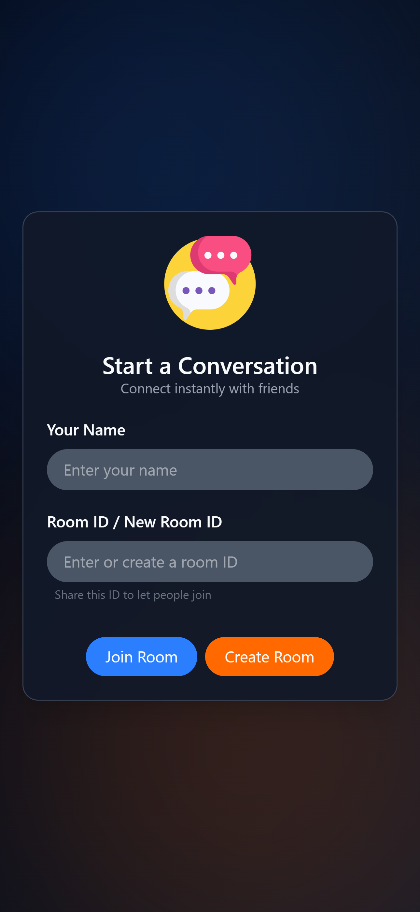
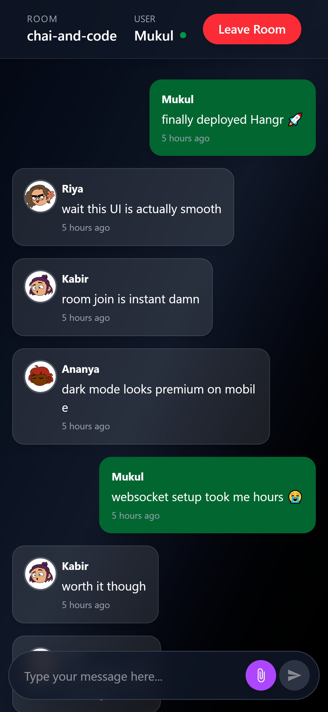

# 💬 Hangr - Connect instantly in shared virtual spaces

<!-- <p align="center">
  
</p> -->

<p align="center">
  <a href="https://gohangr.vercel.app/" target="_blank">
    
  </a>
  
  
  
  
  
</p>

> Hangr is a full-stack real-time group chat application.
> Create or join virtual rooms, send messages instantly over WebSocket, and pick up every conversation exactly where it left off - full history loads on join.

---

## 📸 Screenshots

| Landing Page | Chat Room |
|:---:|:---:|
|  |  |

---

## ✨ Features

- 🏠 **Create rooms** : enter a name and a custom room ID; room ID is automatically copied to clipboard on creation
- 🔗 **Join rooms** : jump into any existing room with just the room ID and your name
- 💬 **Real-time messaging** : messages delivered instantly via STOMP over SockJS WebSockets
- 📜 **Persistent chat history** : all messages stored in MongoDB as embedded documents and loaded in full on join
- 🧑‍🤝‍🧑 **Auto-generated avatars** : unique DiceBear avatars per username for other users in the room
- 🌙 **Dark mode by default** : app ships with `class="dark"` on the HTML root; Tailwind CSS v4 handles theming
- 📱 **Responsive layout** : mobile-friendly chat view, message area constrained to `md:w-2/3` on desktop
- 🔒 **Route protection** : `/chat` redirects to `/` if user is not connected (no auth bypass)
- 🐳 **Dockerized backend** : two-stage build (Maven compile → slim JRE runtime image)
- ☁️ **Deployed** : frontend on Vercel, backend on Render

---

## 🏗️ Architecture

```
┌─────────────────────────────────────────────────────────────────┐
│                           CLIENT                                │
│                  React 19 + Vite 8 (Vercel)                     │
│                                                                 │
│   [ JoinCreateChat.jsx ]        [ ChatPage.jsx ]                │
│   Enter name + roomId           Messages view + input bar       │
│          │                              │                       │
│          │ REST via axios               │ WebSocket (SockJS)    │
│          │ /api/v1/rooms/**             │ baseURL/chat          │
└──────────┼──────────────────────────────┼────────────────────────┘
           │                              │
           ▼                              ▼
┌─────────────────────────────────────────────────────────────────┐
│                      SERVER (Render)                            │
│               Spring Boot 4.0.6 — port 8080                     │
│                                                                 │
│  ┌──────────────────────────┐  ┌───────────────────────────┐    │
│  │     RoomController       │  │      ChatController       │    │
│  │  @RequestMapping         │  │  @MessageMapping          │    │
│  │  /api/v1/rooms           │  │  /sendMessage/{roomId}    │    │
│  │                          │  │  @SendTo                  │    │
│  │  POST   /                │  │  /topic/room/{roomId}     │    │
│  │  GET    /{roomId}        │  └────────────┬──────────────┘    │
│  │  GET    /{roomId}/       │               │                   │
│  │         messages         │               │                   │
│  └────────────┬─────────────┘               │                   │
│               └──────────────┬──────────────┘                   │
│                              ▼                                  │
│                   RoomRepository                                │
│               (Spring Data MongoDB)                             │
│               findByRoomId(String)                              │
└──────────────────────────────┼──────────────────────────────────┘
                               │
                               ▼
┌─────────────────────────────────────────────────────────────────┐
│                       MongoDB Atlas                             │
│                     Collection: rooms                           │
│     { roomId, messages: [{ sender, content, timeStamp }] }      │
└─────────────────────────────────────────────────────────────────┘

WebSocket Message Flow:
  User types → stompClient.send(/app/sendMessage/{roomId})
             → ChatController saves message to MongoDB
             → @SendTo broadcasts to /topic/room/{roomId}
             → all subscribers receive the message instantly
             → setMessages(prev => [...prev, newMessage])
```

---

## 🛠️ Tech Stack

| Layer | Technology | Version / Notes |
|-------|-----------|-----------------|
| Frontend framework | React | 19.2.5 |
| Build tool | Vite | 8.0.10 |
| Styling | Tailwind CSS | v4 — CSS-first config via `@tailwindcss/vite` plugin |
| Routing | React Router | v7.15.0 |
| HTTP client | Axios | 1.16.0 |
| WebSocket | SockJS + `@stomp/stompjs` | SockJS 1.6.1, STOMP 7.3.0 |
| Notifications | react-hot-toast | 2.6.0 |
| Icons | react-icons | 5.6.0 |
| Avatars | DiceBear API | `adventurer` style, seeded by username |
| Backend | Spring Boot | 4.0.6 |
| Language | Java | 21 |
| Boilerplate reduction | Lombok | `@Getter`, `@Setter`, `@NoArgsConstructor`, `@AllArgsConstructor` |
| Database | MongoDB Atlas | Messages stored as embedded array in Room document |
| Deployment — frontend | Vercel | — |
| Deployment — backend | Render (free tier) | ~30s cold start on first request |
| Container | Docker - multi-stage | Maven 3.9 + Eclipse Temurin 21 → `openjdk:21-jdk-slim` |

---

## 🚀 Live Demo

👉 **[gohangr.vercel.app](https://gohangr.vercel.app)**

No account needed. Enter any name and a room ID to start.

**To try it out:**

1. Open the app, enter your name + any room ID → click **Create Room**
2. Room ID gets copied to your clipboard automatically
3. Share the room ID with someone else - they enter the same ID → **Join Room**
4. Messages appear on both sides instantly

> ⚠️ Backend is on Render's free tier - the first request after inactivity may take ~30 seconds to wake up.

---

## 📡 API Reference

**Base URL:** `https://chatappbackend-w9o2.onrender.com`

---

### `POST /api/v1/rooms` - Create a Room

```http
POST /api/v1/rooms
Content-Type: text/plain

my-room-123
```

> Body is a **plain text string** - the room ID. Not JSON.

**201 Created:**
```json
{
  "id": "68203ac3f32be25fa9e5da10",
  "roomId": "my-room-123",
  "messages": []
}
```

**400 Bad Request** - if room already exists:
```
Room already exists!
```

---

### `GET /api/v1/rooms/{roomId}` - Get / Join a Room

```http
GET /api/v1/rooms/my-room-123
```

**200 OK:**
```json
{
  "id": "68203ac3f32be25fa9e5da10",
  "roomId": "my-room-123",
  "messages": [
    {
      "sender": "Alice",
      "content": "Hey!",
      "timeStamp": "2025-05-10T14:32:10.123"
    }
  ]
}
```

**400 Bad Request** - if room doesn't exist:
```
Room not found!!
```

---

### `GET /api/v1/rooms/{roomId}/messages` - Get Messages

```http
GET /api/v1/rooms/my-room-123/messages?page=0&size=20
```

| Param | Default | Description |
|-------|---------|-------------|
| `page` | `0` | Page index (0-based) |
| `size` | `20` | Messages per page |

> Frontend calls this with `size=50, page=0` by default (see `RoomService.js`).

**200 OK:**
```json
[
  {
    "sender": "Alice",
    "content": "Hey!",
    "timeStamp": "2025-05-10T14:32:10.123"
  },
  {
    "sender": "Bob",
    "content": "Hello!",
    "timeStamp": "2025-05-10T14:32:45.456"
  }
]
```

---

## 🔌 WebSocket Reference

**Connection endpoint:** `https://chatappbackend-w9o2.onrender.com/chat`
Uses SockJS - not a raw WebSocket URL.

**Allowed origin:** `https://gohangr.vercel.app/` (configured in `AppConstants.java`)

| Direction | Destination | Description |
|-----------|------------|-------------|
| Client → Server | `/app/sendMessage/{roomId}` | Send a message to a room |
| Server → Client | `/topic/room/{roomId}` | Subscribe to receive messages in a room |

**Message payload (client → server):**
```json
{
  "sender": "Alice",
  "content": "Hello everyone!",
  "roomId": "my-room-123"
}
```

**Broadcast payload (server → client):**
```json
{
  "sender": "Alice",
  "content": "Hello everyone!",
  "timeStamp": "2025-05-10T14:32:10.123"
}
```

**JavaScript example (how the frontend does it):**
```javascript
import SockJS from 'sockjs-client';
import { Stomp } from '@stomp/stompjs';

const sock = new SockJS('https://chatappbackend-w9o2.onrender.com/chat');
const client = Stomp.over(sock);

client.connect({}, () => {
  // Subscribe to room messages
  client.subscribe(`/topic/room/${roomId}`, (message) => {
    const msg = JSON.parse(message.body);
    // { sender, content, timeStamp }
  });

  // Send a message
  client.send(
    `/app/sendMessage/${roomId}`,
    {},
    JSON.stringify({ sender, content, roomId })
  );
});

// Disconnect on cleanup
client.disconnect();
```

---

## 🗄️ Database Schema

**Collection: `rooms`**

```json
{
  "_id": "ObjectId (auto-generated by MongoDB)",
  "roomId": "string — user-defined, unique",
  "messages": [
    {
      "sender": "string",
      "content": "string",
      "timeStamp": "LocalDateTime — set server-side at time of receipt"
    }
  ]
}
```

> Messages are stored as an **embedded array** inside the Room document - no separate messages collection. `timeStamp` is always set by the server (`LocalDateTime.now()`), never trusted from the client.

---

## 🏃 Running Locally

### Prerequisites

- Java 21
- Maven (or use included `./mvnw`)
- Node.js 18+
- MongoDB running locally on port `27017`

---

### 1. Backend

```bash
cd chat-app-backend
```

In `src/main/resources/application.properties`, swap the MongoDB URI:
```properties
# Use this for local:
spring.mongodb.uri=mongodb://localhost:27017/chatapp

# Comment out the env var line:
# spring.mongodb.uri=${SPRING_DATA_MONGODB_URI}
```

In `src/main/java/com/substring/chat/config/AppConstants.java`, switch the allowed origin:
```java
// Use this for local:
public static final String FRONT_END_BASE_URL = "http://localhost:5173";

// Comment out production:
// public static final String FRONT_END_BASE_URL = "https://gohangr.vercel.app/";
```

Run:
```bash
./mvnw spring-boot:run
```
Backend starts at `http://localhost:8080`

---

### 2. Backend via Docker

```bash
cd chat-app-backend
docker build -t hangr-backend .
docker run -p 8080:8080 \
  -e SPRING_DATA_MONGODB_URI=mongodb://host.docker.internal:27017/chatapp \
  hangr-backend
```

---

### 3. Frontend

In `src/config/AxiosHelper.js`, point to local backend:
```js
export const baseURL = "http://localhost:8080";
// export const baseURL = "https://chatappbackend-w9o2.onrender.com";
```

```bash
cd front-chat
npm install
npm run dev
```
Frontend starts at `http://localhost:5173`

---

## ⚙️ Environment Variables

**Backend (Render / Docker):**

| Variable | Description |
|----------|-------------|
| `SPRING_DATA_MONGODB_URI` | Full MongoDB connection string (e.g. MongoDB Atlas URI) |

No other environment variables required. CORS origin and server port are set in `application.properties` and `AppConstants.java`.

---

## 📁 Project Structure

```
Hangr/
│
├── chat-app-backend/                         # Spring Boot application
│   ├── src/main/java/com/substring/chat/
│   │   ├── ChatAppBackendApplication.java    # Entry point
│   │   ├── config/
│   │   │   ├── AppConstants.java             # CORS allowed origin
│   │   │   └── WebSocketConfig.java          # STOMP broker + SockJS endpoint
│   │   ├── controllers/
│   │   │   ├── RoomController.java           # REST: create, join, get messages
│   │   │   └── ChatController.java           # WebSocket: receive, save, broadcast
│   │   ├── entities/
│   │   │   ├── Room.java                     # MongoDB @Document
│   │   │   └── Message.java                  # Embedded message (not a collection)
│   │   ├── payload/
│   │   │   └── MessageRequest.java           # Incoming WS payload DTO
│   │   └── repositories/
│   │       └── RoomRepository.java           # MongoRepository + findByRoomId
│   ├── src/main/resources/
│   │   └── application.properties
│   ├── Dockerfile                            # Two-stage: Maven build → JRE runtime
│   └── pom.xml                              # Spring Boot 4.0.6, Java 21, Lombok
│
├── front-chat/                               # React frontend
│   ├── index.html                            # Sets class="dark" — dark mode always on
│   ├── src/
│   │   ├── main.jsx                          # BrowserRouter + ChatProvider + Toaster
│   │   ├── App.jsx                           # Renders JoinCreateChat
│   │   ├── index.css                         # Tailwind v4 import + custom scrollbar
│   │   ├── components/
│   │   │   ├── JoinCreateChat.jsx            # Landing page: create / join room
│   │   │   └── ChatPage.jsx                  # Chat UI, WebSocket logic, message list
│   │   ├── context/
│   │   │   └── ChatContext.jsx               # Global state: roomId, currentUser, connected
│   │   ├── config/
│   │   │   ├── AxiosHelper.js                # Axios instance + baseURL export
│   │   │   ├── Routes.jsx                    # App routes (/, /chat, /about, *)
│   │   │   └── helper.js                     # getTimeAgo() utility
│   │   └── services/
│   │       └── RoomService.js                # createRoomApi, joinChatApi, getMessages
│   ├── tailwind.config.js                    # darkMode: "class"
│   ├── vite.config.js                        # Vite + React + Tailwind CSS v4 plugin
│   └── package.json
│
├── sample_screenshots/
│   ├── landing_page.png
│   └── chat_page.png
│
└── notes.txt                                 # Local dev note (Windows MongoDB start cmd)
```

---

## 📄 License

This project is licensed under the [MIT License](./LICENSE).

---

<p align="center">
  Built with ☕ Spring Boot and ⚛️ React by <a href="https://github.com/mukul-nayak">Mukul Nayak</a>
</p>


